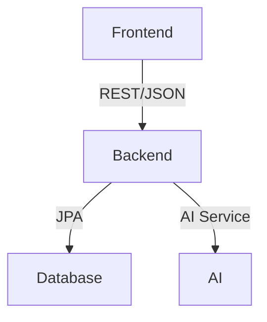

# 🧩 Full-Stack Form Management System  
Developed a full-stack form management platform with a Spring Boot (Java 17) + PostgreSQL backend and a React frontend. Features include JWT-based authentication, dynamic form schema generation, and AI-assisted form analysis for secure and flexible data workflows.

---

## 📝 Overview  
A dynamic **form builder and management platform** with:  
- **React (Vite + TypeScript)** frontend  
- **Spring Boot (Java 17)** backend  
- **JWT-based authentication**  
- **AI-assisted survey generation**

Users can design, preview, and manage forms interactively, with secure backend persistence and analytics.

---

## 🚀 Features  

### 🧠 Frontend
- Modular pages and reusable components  
- API integration via Axios/Fetch  
- Form creation, editing, preview, and submission  
- Real-time analytics and charts (Chart.js)

### ⚙️ Backend
- Layered structure: `Controller → Service → Repository`  
- JWT-based authentication and role-based access control  
- AI endpoints: `/api/ai/preview-form` and `/api/ai/generate-form`  
- Form and submission persistence (PostgreSQL)

---

## ⚡️ Architecture  



- Frontend: React 18 + TypeScript (Vite)  
- Backend: Spring Boot 2.7.7 + PostgreSQL  
- AI: Backend service generates forms via `/api/ai/preview-form`

---

## 🗃️ Data Model (Simplified)

| Entity       | Description |
|---------------|-------------|
| **User**      | Can create `Form` objects and submit `FormRecord` entries |
| **Form**      | Contains `Questions` and stores `FormRecord` submissions |
| **Question**  | Holds text, type, and options (for MCQ) |
| **FormRecord**| Maps user responses to questions |

---

## 📁 Project Structure  

```
project-root/
├── frontend-master/    # React SPA
│   ├── src/components/
│   ├── src/pages/
│   ├── src/services/
│   └── src/App.tsx
└── backend/            # Spring Boot + PostgreSQL
    └── src/main/java/org/example/backend/
        ├── controller/
        ├── dto/
        ├── model/
        ├── service/
        ├── repository/
        └── security/
```

---

## ⚡️ Quick Start  

### 🔧 Backend  
```bash
cd backend
# Copy config and set DB credentials
cp src/main/resources/application.example.properties src/main/resources/application.properties
# Run
./gradlew bootRun
```

### 💻 Frontend  
```bash
cd frontend-master
npm install
npm run dev
```

- Frontend: http://localhost:5173  
- Backend: http://localhost:8080

---

## 🔒 Security  
- JWT-based login/signup (`/auth/*`)  
- Role-based access control for form management and submission  
- AI endpoints: `/api/ai/preview-form`, `/api/ai/generate-form`

---

## 🧠 AI Integration  
- **POST `/api/ai/preview-form`**: Returns form suggestions based on JSON input (`AIFormRequest` DTO)

---

## 📊 Analytics  
- Form and submission reporting: `/api/analytics/*`  
- Frontend charts via **Chart.js**

---

## 🛠️ Deployment  
- **Local:** Vite + Spring Boot  
- **Production:** Docker (`docker-compose.yml` launches frontend + backend + DB)

---

## 🧑‍💻 Contributing Guidelines  

1. **Branching:**  
   - Feature branches from `develop` or `main`  
   - Conventional Commits (e.g., `feat: add dynamic validation logic`)  

2. **Frontend Standards:**  
   - Follow TypeScript definitions strictly  
   - Lint with ESLint, format with Prettier  

3. **Backend Standards:**  
   - Follow Spring conventions  
   - Prefer immutable DTOs  
   - Secure all endpoints  

4. **Pull Requests:**  
   - Detailed description of changes, testing, and potential breaking changes

---

# 👩‍💻 Authors
- Dorsa Sharifi Ghombavani – Frontend & Backend Developer 

---

# 📜 License

[](https://react.dev/)
[](https://spring.io/projects/spring-boot)
[](https://www.postgresql.org/)
[](LICENSE)
---
 
