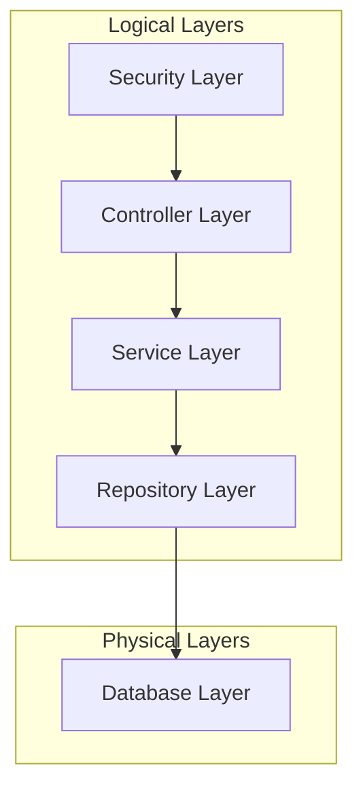

# Form Management System Backend

## System Architecture

### High-Level Module Overview



### Module Details and Coupling

#### Controller Layer (`org.example.backend.controller`)
- **ApiController**: Handles authentication endpoints
- **FormController**: Manages form operations
- **Coupling**: Loose coupling with Service layer through dependency injection

#### Service Layer (`org.example.backend.service`)
- **FormService**: Core form management logic
- **FormDataService**: Dynamic form data handling
- **QueryService**: Custom query execution
- **Coupling**: Moderate coupling with Repository layer through JPA interfaces

#### Repository Layer (`org.example.backend.repository`)
- **FormRepository**: Form data persistence
- **QuestionRepository**: Question data persistence
- **Coupling**: Tight coupling with Database layer through JPA/Hibernate

#### Security Layer (`org.example.backend.security`)
- **SecurityConfig**: Spring Security configuration
- **JwtUtil**: JWT token management
- **Coupling**: Loose coupling with Controller layer through Spring Security filters

#### Model Layer (`org.example.backend.model`)
- **Form**: Form entity
- **Question**: Question entity
- **Coupling**: Moderate coupling with Repository layer through JPA annotations

### Data Models (UML)

```mermaid
classDiagram
    class User {
        +Long id
        +String username
        +String email
        +String password
        +List<Form> createdForms
        +List<FormRecord> submissions
    }

    class Form {
        +Long id
        +String title
        +String description
        +User owner
        +List<Question> questions
        +List<FormRecord> submissions
        +DateTime createdAt
        +Boolean allowAnonymous
    }
    
    class Question {
        +Long id
        +String text
        +String type
        +List<String> choices
        +Form form
        +Integer orderIndex
    }

    class FormRecord {
        +Long id
        +Form form
        +User submitter
        +Boolean isAnonymous
        +Map<Question, String> responses
        +DateTime submittedAt
        +String ipAddress
    }

    User "1" --> "*" Form : creates
    User "0..1" --> "*" FormRecord : submits
    Form "1" --> "*" Question : contains
    Form "1" --> "*" FormRecord : has
    FormRecord "*" --> "1" Form : belongs to
    FormRecord "*" --> "0..1" User : submitted by
```



#### Entity Relationships Explained

1. **User - Form Relationship**
   - A User can create multiple Forms (one-to-many)
   - Each Form must have an owner User (many-to-one)

2. **Form - Question Relationship**
   - A Form contains multiple Questions (one-to-many)
   - Each Question belongs to exactly one Form (many-to-one)
   - Questions have an orderIndex to maintain their sequence

3. **Form - FormRecord Relationship**
   - A Form can have multiple FormRecords (submissions)
   - Each FormRecord belongs to exactly one Form
   - FormRecords store the actual responses to Questions

4. **User - FormRecord Relationship**
   - A User can submit multiple FormRecords
   - A FormRecord can be anonymous (no User)
   - When not anonymous, FormRecord links to the submitting User

#### Additional Features
- Forms can be configured to allow/disallow anonymous submissions
- FormRecords track submission metadata (IP, timestamp)
- Questions maintain their order in the form
- Responses are stored as key-value pairs linking Questions to answers

## Technology Stack

### Backend Framework
- **Spring Boot** (v2.7.7)
- **Java** (v17)

### Security
- Spring Security
- JWT Authentication (nimbus-jose-jwt v9.1.1)

### Database
- PostgreSQL
- Spring Data JPA
- Dynamic table creation for form responses

### Build Tools
- Gradle
- GraalVM Native Support

### Testing
- JUnit 5
- Spring Boot Test
- Spring Modulith

## Key Features

1. **Dynamic Form Management**
   - Create custom forms with various question types
   - Dynamic database table creation for form responses
   - Flexible query system for form data analysis

2. **Security**
   - JWT-based authentication
   - Configurable security policies
   - CORS and CSRF protection

3. **Data Processing**
   - Aggregated query support
   - Custom data validation
   - Transaction management

## Module Coupling Analysis

### Tight Coupling
- Model-Repository: Due to JPA annotations and database schema dependencies

### Moderate Coupling
- Service-Repository: Through JPA interfaces but with abstraction
- Controller-Service: Through business logic dependencies

### Loose Coupling
- Security-Controller: Through Spring Security filters
- Service-Model: Through DTO transformations

## Project Structure

```
backend/
├── src/
│   ├── main/
│   │   ├── java/
│   │   │   └── org/example/backend/
│   │   │       ├── controller/
│   │   │       ├── dto/
│   │   │       ├── model/
│   │   │       ├── repository/
│   │   │       ├── security/
│   │   │       └── service/
│   │   └── resources/
│   └── test/
└── build.gradle
```

## Getting Started

1. Ensure you have Java 17 installed
2. Configure PostgreSQL database
3. Update application.properties with database credentials
4. Run `./gradlew bootRun` to start the application

## API Documentation

The API provides endpoints for:
- Form creation and management
- User authentication
- Form submission
- Data querying and analysis

Detailed API documentation is available at `/swagger-ui.html` when running the application. 